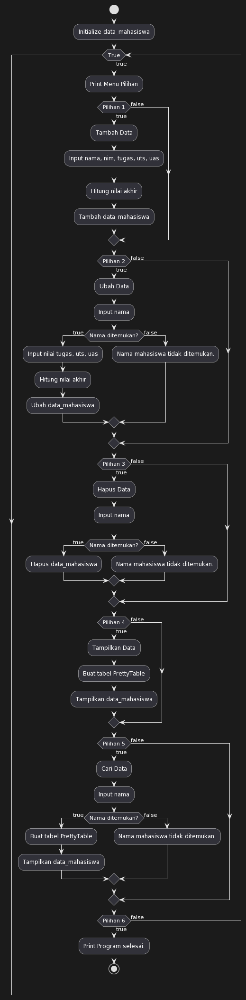
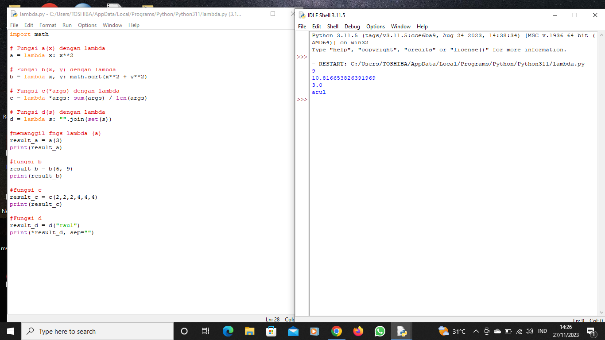
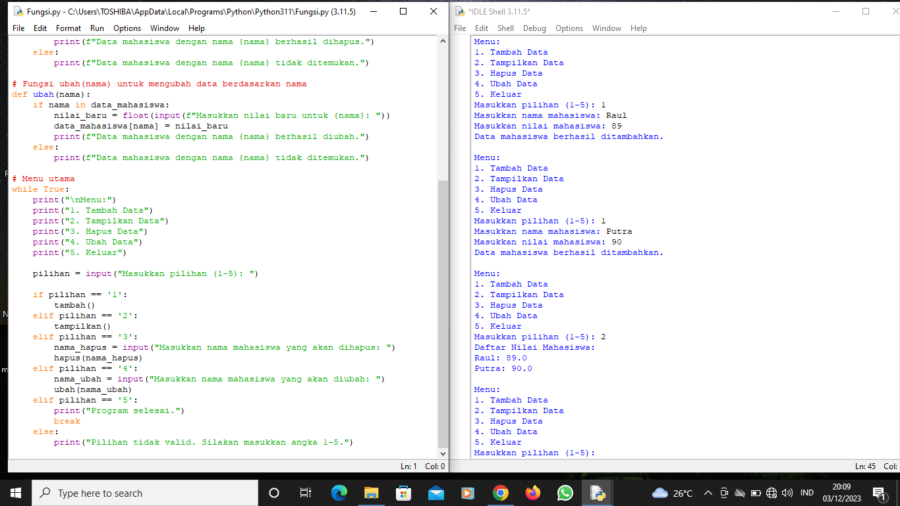

# Pertemuan11

# Flowchart

Penjelasan Langkah-langkah

1. *Inisialisasi Dictionary:*
   - Inisialisasi dictionary untuk menyimpan data mahasiswa. Misalnya, `data_mahasiswa = {}`.

2. *Fungsi tambah():*
   - Menerima input nama dan nilai mahasiswa.
   - Menambahkan entri baru ke dalam dictionary menggunakan nama sebagai kunci dan nilai sebagai nilai.
   - Memberikan pesan konfirmasi.

3. *Fungsi tampilkan():*
   - Menampilkan judul "Daftar Nilai Mahasiswa".
   - Menggunakan loop untuk mencetak setiap entri dalam dictionary.

4. *Fungsi hapus(nama):*
   - Menerima input nama mahasiswa yang akan dihapus.
   - Memeriksa apakah nama tersebut ada dalam dictionary.
   - Jika ada, hapus entri dengan nama tersebut dan beri pesan konfirmasi.
   - Jika tidak ada, beri pesan bahwa nama tidak ditemukan.

5. *Fungsi ubah(nama):*
   - Menerima input nama mahasiswa yang akan diubah.
   - Memeriksa apakah nama tersebut ada dalam dictionary.
   - Jika ada, minta input nilai baru dan perbarui nilai pada entri tersebut.
   - Jika tidak ada, beri pesan bahwa nama tidak ditemukan.

6. *Menu Utama (Loop):*
   - Gunakan loop (misalnya, `while True`) untuk membuat menu utama.
   - Tampilkan opsi menu: tambah, tampilkan, hapus, ubah, keluar.
   - Terima input dari pengguna.
   - Terapkan kondisional (`if`, `elif`, `else`) untuk memanggil fungsi yang sesuai berdasarkan pilihan pengguna.

7. *Pesan Kesalahan:*
   - Tambahkan pesan kesalahan jika pengguna memasukkan pilihan yang tidak valid.

8. *Keluar dari Program:*
   - Tambahkan opsi untuk keluar dari program, misalnya dengan memasukkan angka atau kata kunci tertentu.

9. *Tes Program:*
   - Jalankan program dan uji setiap fungsi dengan memasukkan data, menampilkan, menghapus, dan mengubah nilai mahasiswa.

10. *Optimasi dan Peningkatan:*
   - Sesuaikan program sesuai kebutuhan dan tambahkan fitur tambahan jika diperlukan.
   - Pastikan program dapat mengatasi kasus-kasus ekstrem atau input yang tidak valid.

Setelah membuat program dengan langkah-langkah ini, Anda dapat menjalankannya dan menggunakannya untuk mengelola daftar nilai mahasiswa sesuai kebutuhan.

Latihan Lambda

Praktikkum Fungsi

